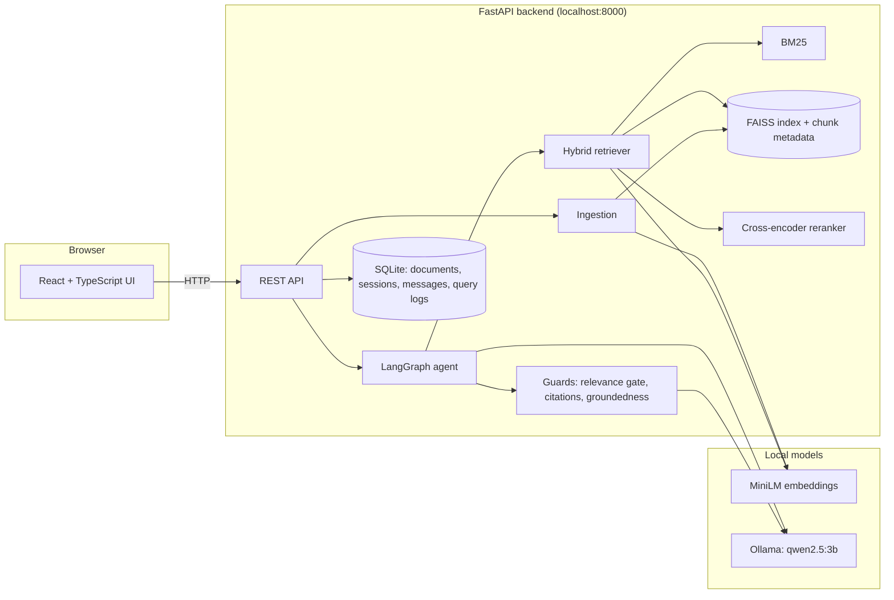
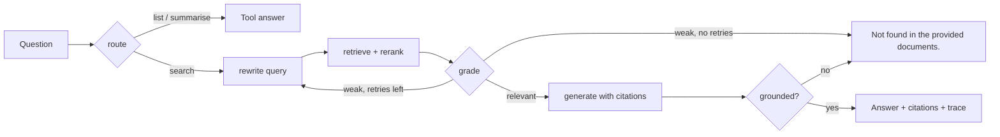

# CiteLocal

A fully local question-answering assistant for an organisation's internal PDFs. Upload
documents, ask questions, and get answers that cite the file and page they came from. When
the documents don't contain the answer, it says so instead of guessing.

Everything runs on one machine: embeddings, search, reranking and the LLM (via Ollama).
**No document text, question or answer leaves the computer.**

It started as a 130-line RAG script (`scripts/original_main.py`: one PDF -> FAISS -> Ollama)
and was rebuilt into a tested full-stack application, with every change measured against
that original baseline.

## Features

- **Multi-document ingestion**: page-aware chunks with document, page and collection
  metadata; SHA-256 deduplication; incremental add and delete without rebuilding the index.
- **Hybrid retrieval**: BM25 + dense embeddings fused with reciprocal rank fusion, then a
  CPU cross-encoder reranker (20 candidates -> top 5); filter by document or collection.
- **Hallucination guards**: a calibrated relevance gate that abstains before calling the LLM,
  citations validated against the retrieved pages, and an LLM groundedness check.
- **LangGraph agent**: query rewriting, chunk grading, up to 2 retries, three tools
  (`search_documents`, `list_documents`, `summarise_document`) and a step-by-step trace
  returned with every answer.
- **FastAPI + SQLite** backend with sessions, message history and per-query logs.
- **React + TypeScript** UI: upload, chat, citations under each answer, agent trace.
- **Evaluation harness** with real, reproducible numbers ([docs/EVAL.md](docs/EVAL.md)).

## Architecture



Agent flow for a question:



## Results

Real numbers from `scripts/eval.py` and `scripts/eval_guards.py` on 10 arXiv papers
(982 chunks), CPU only (Ryzen 5 7530U). Details and caveats are in [docs/EVAL.md](docs/EVAL.md).

**Retrieval** (49 questions with expected document and page; hit = right document *and* page):

| Method | Hit@k | MRR | Latency |
|---|---|---|---|
| Original script: dense top-3 | 0.612 | 0.500 | 34 ms |
| Dense top-5 | 0.673 | 0.515 | 37 ms |
| Hybrid BM25 + dense (RRF) top-5 | 0.857 | 0.661 | 44 ms |
| Hybrid + cross-encoder rerank top-5 | **0.878** | **0.664** | 1935 ms |

**Effect of corpus size** (page-level hit rate; 3-PDF corpus = Attention, BERT, RAG with 19 questions):

| Method | 3 PDFs (227 chunks) | 10 PDFs (982 chunks) | Change |
|---|---|---|---|
| Original script: dense top-3 | 0.789 | 0.612 | -0.177 |
| Dense top-5 | 0.895 | 0.673 | -0.222 |
| Hybrid BM25 + dense (RRF) top-5 | 0.947 | 0.857 | -0.090 |
| Hybrid + cross-encoder rerank top-5 | 0.947 | 0.878 | -0.069 |

Dense-only search degrades sharply as more papers on overlapping topics are added; hybrid search
holds up far better.

**Hallucination guards: single-pass pipeline vs LangGraph agent** (`qwen2.5:3b`, threshold -0.11,
49 answerable + 12 unanswerable questions). The agent is what the API uses.

| Metric | Single-pass pipeline | Agent |
|---|---|---|
| Unanswerable questions refused | 100% (12/12) | 100% (12/12) |
| Answerable questions wrongly refused | 20.4% (10/49) | **14.3%** (7/49) |
| Answers with a valid citation | 79.5% (31/39) | **81.0%** (34/42) |
| Answers citing the exact expected page | 56.4% (22/39) | **57.1%** (24/42) |
| Latency per question (mean / median) | 27.3 s / 33.4 s | **18.9 s / 17.5 s** |

In the pipeline, 11 of the 12 unanswerable questions were stopped by the relevance gate before any
LLM call. The agent probably does better because it generates only from chunks that clear the
relevance threshold, giving the 3B model a shorter, cleaner context (see the analysis in EVAL.md).

The eval questions were drafted with AI help and reviewed by hand against the PDFs; the threshold was
calibrated on the same questions (no held-out set). See [docs/EVAL.md](docs/EVAL.md) for the
caveats and failure analysis.

## Setup

Prerequisites: Python 3.13, Node 22+, and [Ollama](https://ollama.com).

```bash
# 1. Local LLM
ollama pull qwen2.5:3b

# 2. Python environment
python -m venv venv
venv\Scripts\activate            # macOS/Linux: source venv/bin/activate
pip install -r requirements.txt

# 3. One-time download of the embedding and reranker models (the app runs offline afterwards)
python -m scripts.download_models

# 4. Frontend dependencies
cd frontend
npm install
cd ..
```

## Run

```bash
# Terminal 1: backend (from the repository root)
venv\Scripts\activate
uvicorn backend.app.main:app --port 8000

# Terminal 2: frontend
cd frontend
npm run dev
```

Open http://localhost:5173 and upload PDFs from the sidebar. API docs are at
http://localhost:8000/docs.

Optional:

```bash
python -m scripts.ingest path/to/pdfs --collection hr   # bulk-ingest a folder
python -m pytest                                        # 39 tests; no Ollama needed
python -m scripts.download_corpus                       # the evaluation corpus (10 arXiv papers)
python -m scripts.eval retrieval                        # retrieval metrics
python -m scripts.calibrate                             # relevance-gate threshold
python -m scripts.eval_guards                           # end-to-end guard metrics (slow on CPU)
```

All settings (models, chunk size, top-k, threshold, paths) are in `backend/config.py` and can be
overridden with `PDA_*` environment variables or a `.env` file.

## Privacy model

- **No network calls at runtime.** The LLM is served by Ollama on `localhost`; embeddings and
  reranking run in-process. Hugging Face offline mode is forced on (`HF_HUB_OFFLINE=1`), so the
  libraries don't check the Hub for model updates. Internet access is only needed once, at setup,
  to download packages and model weights.
- **Data stays in `storage/`** on the local disk: uploaded PDFs, the FAISS index with chunk text,
  and the SQLite database with chat history and query logs. All of it is git-ignored, along with
  `data/` and `.env`.
- The API only accepts browser requests from the local frontend's origin (CORS).
- Not yet covered: authentication and per-user access control, and encryption at rest. Anyone
  who can reach port 8000 or read the disk can see the documents. See Future scope.

## Project layout

```
backend/
  config.py        all settings
  rag/             ingest.py, store.py, retrieval.py, guards.py, pipeline.py, models.py
  agent/           graph.py (LangGraph), tools.py
  app/             main.py (FastAPI), schemas.py (Pydantic)
  db/              models.py, database.py (SQLAlchemy + SQLite)
  tests/           pytest suite (fake LLM, real embedder and reranker)
frontend/src/      App.tsx, api.ts (typed client), styles
scripts/           ingest, eval, calibrate, eval_guards, download_corpus, download_models
eval/              questions.json (evaluation questions with expected document and page)
docs/              EVAL.md (evaluation report)
```

## Future scope

- **ANN index or vector database** (FAISS HNSW/IVF-PQ, Qdrant, pgvector) once the corpus outgrows
  an exact flat index, with native metadata filtering.
- **Ingestion queue** (Celery/RQ or a background worker) so large uploads don't block the request,
  with progress reporting and OCR for scanned PDFs.
- **Postgres** instead of SQLite for concurrent writers and multiple app instances; Alembic
  migrations.
- **Authentication and per-document access control**: SSO/OIDC login, document ACLs, and the
  user's allowed documents applied as a retrieval filter so restricted text never reaches the LLM.
- **Caching**: embeddings of repeated queries, reranker scores, and full answers for identical
  questions over an unchanged index.
- Streaming answers, a PDF viewer that opens the cited page, a larger or GPU-served LLM, and a
  human-reviewed evaluation set built from real user questions (from `query_logs`).
